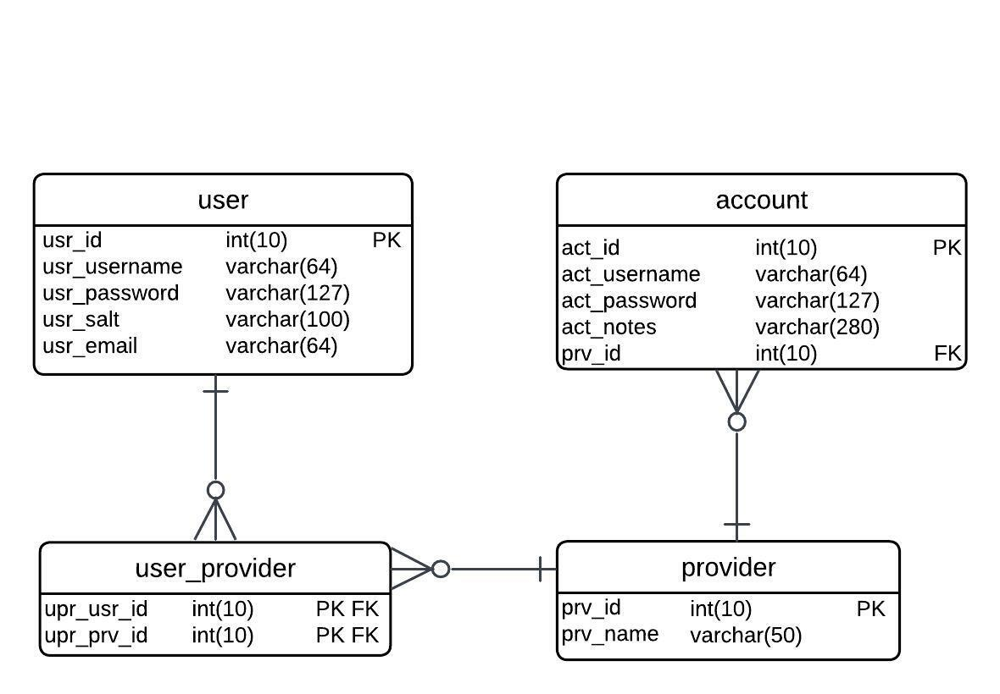

# Tempest

Method | Route                 | Description
------ | --------------------- | ---------
`GET` | `/users`              | Retrieves the entire list of users
`GET` | `/users/credentials`           | Retreives a user by their credentials
`POST`  | `/users/signup`              | Creates a new user account
`POST`  | `/users/login`      | Validates and logs in a user account
`POST`  | `/users/logout`      | Logs a user out
`GET`  | `/users/current`      | Retrieves the current user
`GET`  | `/providers/:providerId`      | Gets a provider by their id
`GET`  | `/users/providers`      | Gets a list of the providers that a user has
`DELETE`  | `/users/providers/:providerId`      | Removes the provider with the given id
`POST`  | `/users/providers`      | Adds a provider
`PUT`  | `/providers/:providerId`      | Changes the name of the given provider
`GET`  | `/providers`      | Gets a list of all of the providers
`GET`  | `/accounts/:providerId`      | Gets all accounts listed under the provider with the given id
`GET`  | `/accounts/:providerId/:accountId`      | get an account with the given id
`PUT`  | `/providers/:providerId/accounts`      | Add an account to the provider
`DELETE`  | `/providers/:providerId/accounts/:accountId`      | Removes an account from the provider
`PUT`  | `/accounts/:providerId/:accountId`      | Changes the field of the account provided by id

ER Diagram

